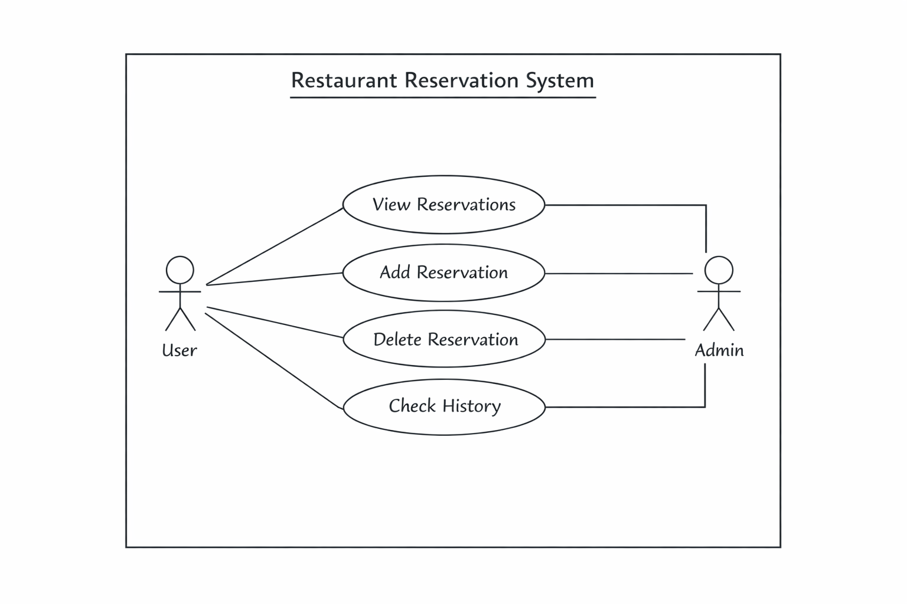
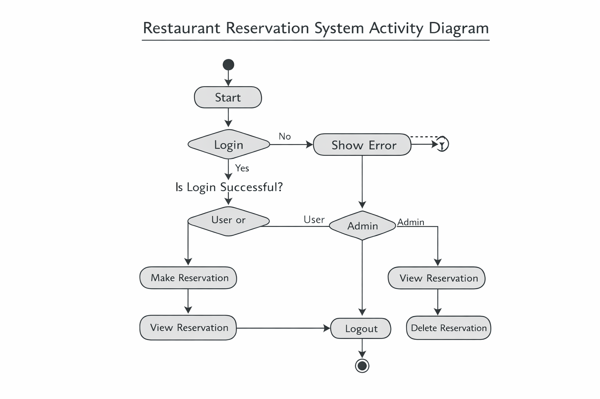
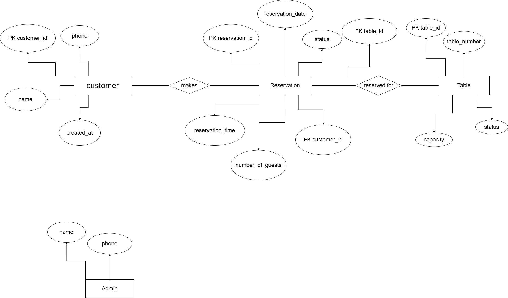
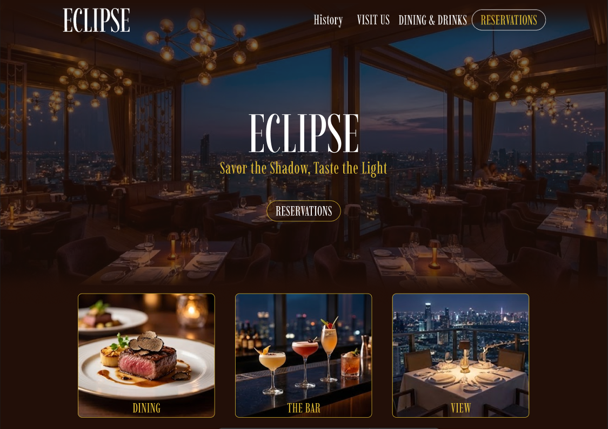
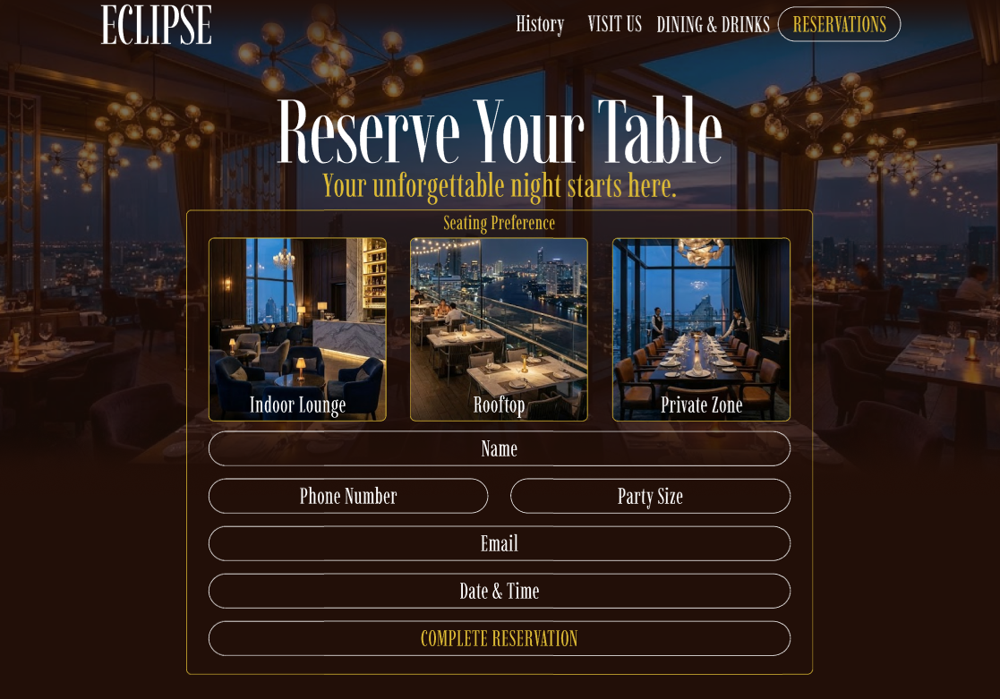
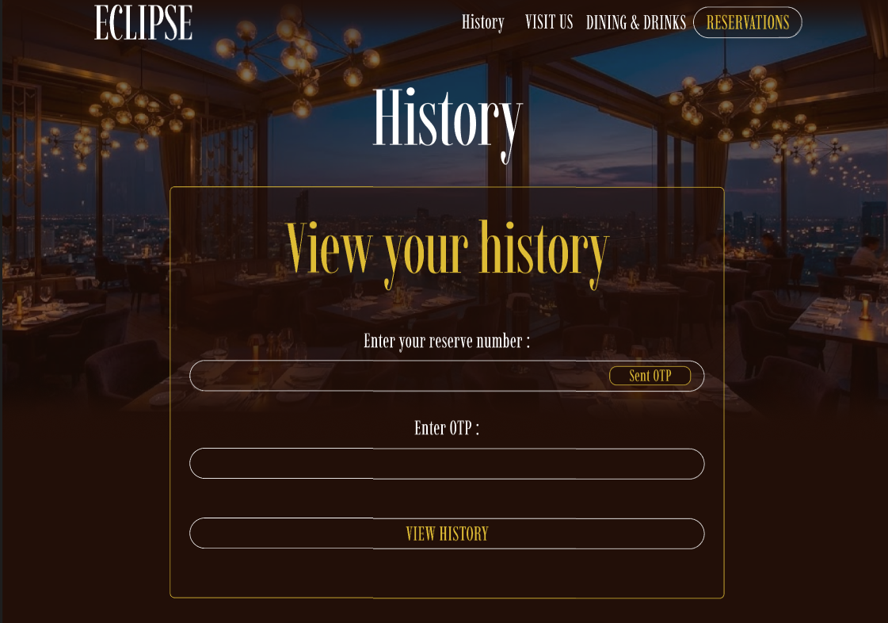
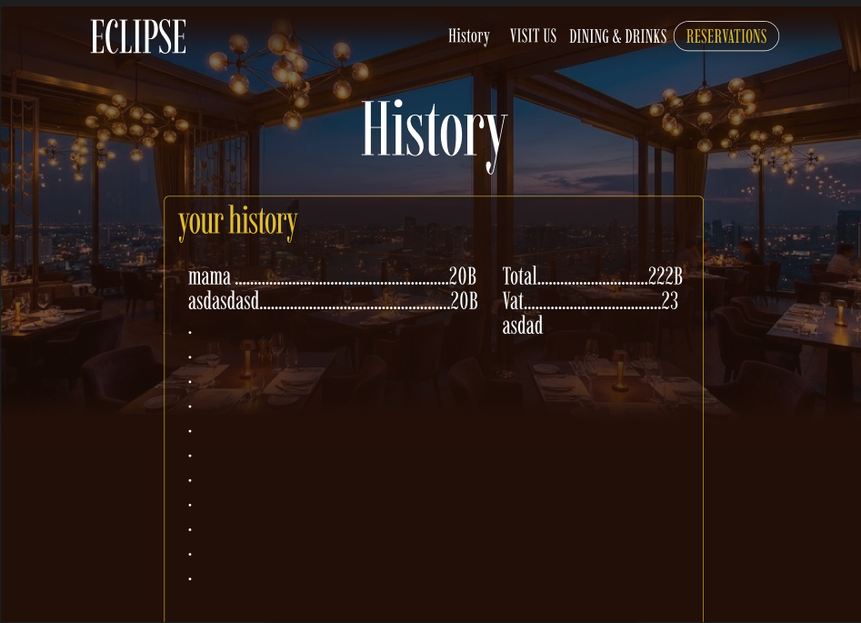
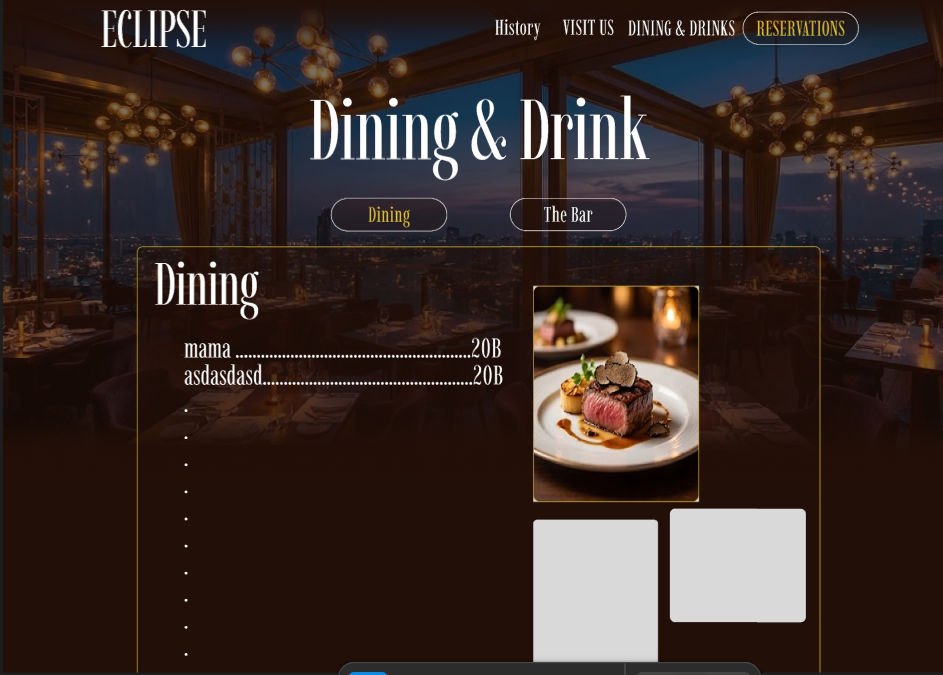
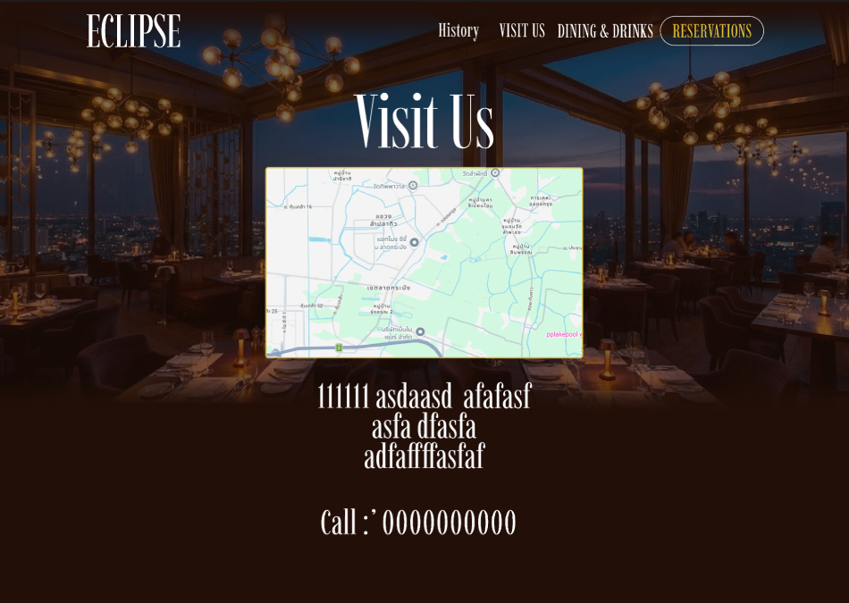

## หน้าที่สมาชิก

---

| รหัสนักศึกษา | ชื่อ-นามสกุล | หน้าที่ |
| :--- | :---: | ---: |
| 68030059 | นางสาวชรัตน์ดา ไพคำนาม	 | Database Feature/Admin |
| 68030072 | นางสาวฐิติกานต์ ประสิทธิ์  | Backend Feature/Customer |
| 68030116 | นายธนภัทร ดิสโร | Frontend Feature/Admin |
| 68030120 | นายธนาเทพ ธีรปกรณ์ | Frontend Feature/Customer |
| 68030232 | นายภูผาสุข ผาสุข | UX/UI Desgin & Test case |
| 68030238 | นางสาวเมจิยานันท์ กันยะ | Backend Feature/Admin |
| 68030246 | นางสาวรัศมี แสงทอง | Database Feature/Customer |

---

## SRS
นำการจัดการร้านอาหาร --> พัฒนาการการจองโต๊ะล่วงหน้า

## ผลงานการออกแบบ
1. System Architecture
1.Frontend 
ทำหน้าที่:
       แสดงข้อมูลโต๊ะ
       กรอกข้อมูลจอง
       ส่ง request ไป API
       แสดงหน้า Map
2.Backend
ทำหน้าที่:
      รับ request จาก frontend
      ประมวลผล logic
      ติดต่อ database

3.Database
ทำหน้าที่: 
       เก็บ reservations

2. Use case diagram

3. Activity Diagram

4. ER Diagram

5. UX/UI
### Homepage

### หน้าจอง

### ประวัติ

### History in

### ตัวอย่างเมนู

### ที่อยู่

## Teach Stack

- Ux/Ui desgin : Figma
- FrontEnd : HTML CSS Js 
- Backend : json js
- DataBase : MySQL
- API : Leaflet.js API = สร้าง Map

 ## Test  case ของระบบ และผลการทดสอบระบบในส่วนที่พัฒนา, API Testing

 ## API End-Point
- admin : 

1. POST /login
- Description: ใช้สำหรับเข้าสู่ระบบ Admin
- Request: username, password
- Response: token

2. GET /dashboard
- Description: ใช้สำหรับดึงข้อมูล Dashboard
- Header: Authorization (token)
- Response: stats, orders, charts

- user :

1. GET - ดูรายการทั้งหมด
- Description: ใช้สำหรับดึงข้อมูลรายการจองทั้งหมดจากระบบ (ข้อมูลถูกเก็บแบบ in-memory)
- Header: Content-Type: application/json
- Response: """" [
  {
    "id": 1,
    "name": "Table for 2",
    "price": 1200
  },
  {
    "id": 2,
    "name": "Table for 4",
    "price": 2000
  }
] """"

2. POST - เพิ่มการจอง
- Description: ใช้สำหรับเพิ่มรายการจองใหม่เข้าสู่ระบบ โดยต้องระบุชื่อและราคา
- Header: Content-Type: application/json
- Request Body : """ {
  "id": 3,
  "name": "Table for 6",
  "price": 3000
} """
- Response : """ {
  "message": "Reservation added"
} """
- Error Response : """ {
  "message": "Invalid data"
} """

3. DELETE - ลบการจอง
- Description: ใช้สำหรับลบข้อมูลการจองตาม id ที่ระบุ
- Header: Content-Type: application/json
- Response: """ {
  "message": "Deleted successfully"
} """ 

4. POST - ตรวจสอบ history
- Description: ใช้สำหรับตรวจสอบประวัติการจอง โดยผู้ใช้ต้องกรอกข้อมูลยืนยัน เช่น หมายเลขจอง อีเมล เบอร์โทร
- Header: Content-Type: application/json
- Request Body : """ {
  "reserveNumber": 1,
  "email": "test@email.com",
  "phone": "0999999999",
} """
- Response : """{
  "message": "Verified",
  "_id": 1
} """
- Error Response :"""{
  "message": "Invalid information"
} """

