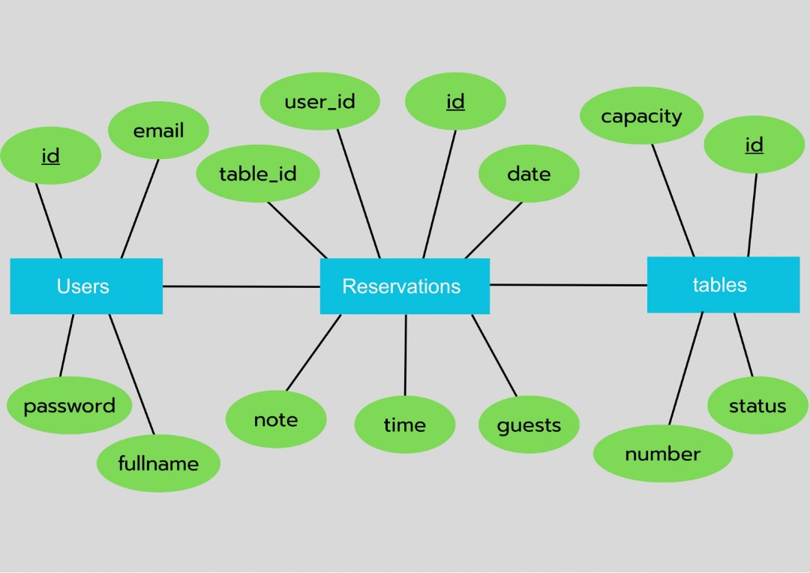
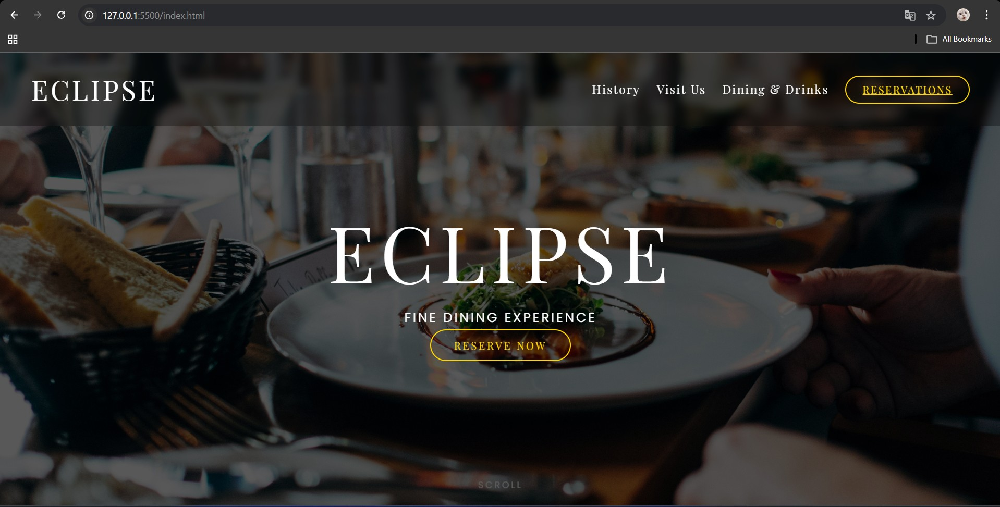
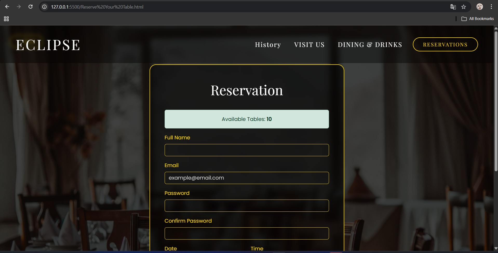
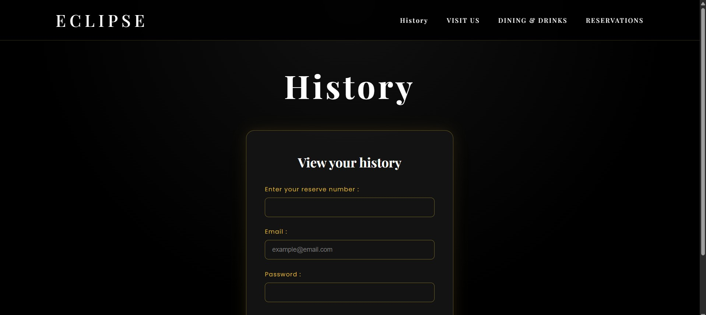
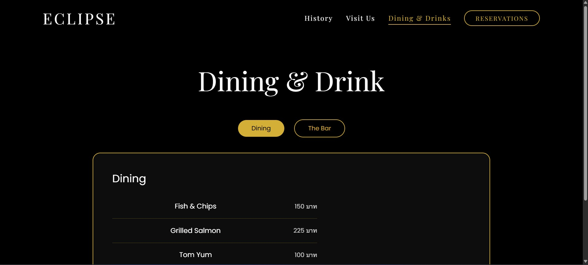

## หน้าที่สมาชิก

---

| รหัสนักศึกษา | ชื่อ-นามสกุล | หน้าที่ |
| :--- | :---: | ---: |
| 68030059 | นางสาวชรัตน์ดา ไพคำนาม	 | Database Feature/Admin |
| 68030072 | นางสาวฐิติกานต์ ประสิทธิ์  | Backend Feature/Customer |
| 68030116 | นายธนภัทร ดิสโร | Frontend Feature/Admin |
| 68030120 | นายธนาเทพ ธีรปกรณ์ | Frontend Feature/Customer |
| 68030232 | นายภูผาสุข ผาสุข | UX/UI Desgin & Test case |
| 68030238 | นางสาวเมจิยานันท์ กันยะ | Backend Feature/Admin |
| 68030246 | นางสาวรัศมี แสงทอง | Database Feature/Customer |

---

## SRS
นำการจัดการร้านอาหาร --> พัฒนาการการจองโต๊ะล่วงหน้า

## ผลงานการออกแบบ
1. System Architecture

2. Use case diagram

3. Activity Diagram

4. ER Diagram

5. UX/UI
### Homepage

### หน้าจอง

### ประวัติ

### History in

### ตัวอย่างเมนู

### ที่อยู่

## Teach Stack

- Ux/Ui desgin : Figma
- FrontEnd : HTML CSS Js 
- Backend : json js
- DataBase : MySQL
- API : Leaflet.js API = สร้าง Map

 ## Test  case ของระบบ และผลการทดสอบระบบในส่วนที่พัฒนา, API Testing

 ## API End-Point
- admin : 

1. POST /login
- Description: ใช้สำหรับเข้าสู่ระบบ Admin
- Request: username, password
- Response: token

2. GET /dashboard
- Description: ใช้สำหรับดึงข้อมูล Dashboard
- Header: Authorization (token)
- Response: stats, orders, charts

